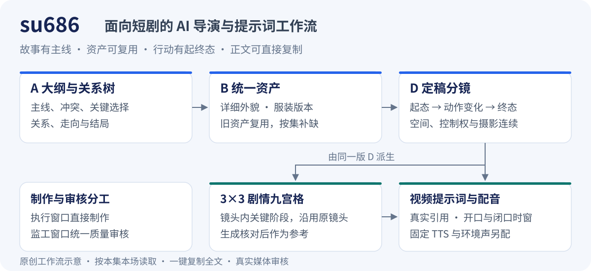

# su686

**面向短剧的 AI 导演与提示词工作流**

把故事主线、统一资产、空间关系、人物行动和对白，连接成可复用、可核对、可直接复制的短剧提示词。

[](LICENSE)


[核心亮点](#核心亮点) · [完整流程](#完整流程) · [导演示例](#导演示例) · [快速开始](#快速开始) · [适用范围](#适用范围) · [文档与许可](#文档与许可)



su686 是提供给 AI 执行环境使用的短剧导演工作流技能，适用于原创、改编和已有定稿的分集制作。它围绕 **A 大纲与关系树、B 统一资产、D 分镜与视频提示词** 三个模块，把“这场戏为什么发生”“人物和空间是什么样”“每一步行动怎样落到镜头里”一起处理。

日常交付是三份互通的 HTML：按本集、本场读取相关内容，展开全文，一键复制，再到实际生成工具中制作并查看效果。这个仓库提供工作流指南与技能元数据；页面和提示词由执行方按指南制作。

## 核心亮点

| 亮点 | 为制作带来的具体价值 |
| --- | --- |
| **故事主线与关系树先行** | A 写清人物目标、阻碍、核心关系、冲突、关键选择和结局。行动推动局势，反转有前因，结局回应开头，让后续镜头服务于同一条主线。 |
| **角色细致，资产按集复用** | B 把脸型、五官、发型、年龄体态和身份特征写到可画、可区分。服装按剧情增补版本；新集复用已有角色、场景和关键物品，只补本集真正缺少的内容，减少重复准备。 |
| **空间固定，行动有起有落** | 场景维护固定几何与少量门窗、家具、通道锚点。D 记录“起态 → 动作变化 → 终态”，摄影换角度时沿用人物与门窗的物理关系。同场连续板上第 9 格接下第 1 格，时跳或转场另选起态。 |
| **一个分镜真源，两类下游正文** | 定稿 D 是唯一镜头真源，3×3 剧情板和视频提示词从同一版动作、表演、摄影与状态派生。九格呈现镜头内的关键阶段，不强制九次切镜，减少上下游各写一套造成的冲突。 |
| **自动 @ 素材引用** | 根据当前分镜，自动选用本段需要的角色服装版本、场景、关键物品及已认可剧情九宫格，把对应的完整素材名写进可复制提示词。沿用已登记名称，让用户直接复制粘贴；参考数量与格式遵守所选平台规则。 |
| **固定 TTS 与说话时窗配合** | 台词含标点、说话人沿用定稿。对应角色在开口时窗说话，其他角色及说完后闭口，画外声不带动可见嘴部。正式合成整条剔除模型原音轨，再对齐固定 TTS 和环境声。 |
| **三模块互通，全文直接复制** | 制作工作台在同一工作区切换 A/B/D，初始打开 D。每项正文可展开全文、一键复制；执行方按本集本场读取上游，减少用户重复填写已有故事、资产和选择。 |
| **一个执行窗口，一个监工窗口** | 执行窗口直接制作与整改，监工窗口统一派工和质量审查。同文件同轮一位实际写手，执行方可用助手提速，避免再组织一层质量审核。 |

模型、画风和画幅按作品选择。每个生成段 **SEG 为 5–15 整数秒**；段内 Shot 可以更短、可以使用正小数，连续覆盖并合计等于该 SEG。切点由动作、信息和节奏决定。

## 完整流程

1. **校准本轮选择。** 已安装 grill-me 时先用它精简校准真正未决事项；未安装时采用等效精简追问，一次一个关键问题。已有定稿和已确认选择直接沿用，grill-me 不是安装硬依赖。
2. **A：建立或沿用故事主线。** 整理主题、人物关系、目标、冲突、选择与结局，把本集需要的剧情依据交给下游。
3. **B：复用资产，补齐本集缺项。** 选择当前角色与服装版本，沿用场景空间基准，准备本集核心物品及其必要状态。
4. **D：先定导演分镜。** 写清行动过程、目光与反应、物品控制权、起终态，以及景别、观看方向、运镜和切点。
5. **从同版 D 派生 3×3 剧情板。** 每格对应实际 Shot 与动作阶段；用户生成或回传并核对后，图片才成为有效参考。
6. **引用认可的剧情板准备视频正文。** 说明本段采用哪些格、各自提供什么构图和状态信息；人物衣着、动作路径、对白与时窗按所选模型适配。成片输出正常连续单画面。
7. **生成、配音与审核。** 使用环境提供的图片、视频和 TTS 工具制作；剔除模型原音轨，再对齐固定配音与环境声。监工根据真实图像、视频、表演和节奏给出问题位置，执行窗口定向整改。

> **自动 @，让素材跟着分镜走。** 例如，本段需要角色甲的日常装、客厅和一把关键钥匙时，提示词自动写入对应的 `@角色甲日常装.png`、`@客厅.png`、`@钥匙.png`；采用剧情九宫格的视频段按实际需要引用对应剧情板。具体名称沿用本项目素材库，服装版本随当前段选择。
>
> 技能负责自动准备引用正文；粘贴后，由支持该语法的平台识别并挂上素材，实际绑定以平台显示或请求映射为准。

## 导演示例

一句“她犹豫后把钥匙交给他”，可以展开成一个有动作过程和控制权变化的镜头段。

以下为**原创写法示例**：12 秒 SEG，3 个镜头，时长分别为 3 秒、5 秒、4 秒。它展示导演分镜如何写清行动；实际生成正文的语言、结构和附件规则按所选模型适配，示例不代表实测成片。

**固定空间与起态**

- 桌子位于房间东侧窗下，门在西墙，桌两侧可通行。
- 甲站桌南侧、朝北；乙站桌北侧、朝南。甲的右手握着钥匙，乙双手空着。
- 换景别或反打时，桌子、门窗与双方物理位置沿用该基准。

| 镜头与时段 | 画面、行动与反应 | 钥匙控制权 |
| --- | --- | --- |
| Shot 1 · 0–3 秒 | 侧面中景。甲先把钥匙放到南侧桌沿，再用右手食指将它推向桌面中央，手指仍压住钥匙环；乙看向钥匙，没有接触。 | 钥匙仍由甲控制，尚未交出。 |
| Shot 2 · 3–8 秒 | 切桌边双人近景。甲仍用食指按住钥匙环，目光从钥匙转向乙；乙张开右手停在钥匙北侧，不催促、不抢拿。甲看了乙一拍，肩膀稍松。 | 甲继续控制；乙等待接收。 |
| Shot 3 · 8–12 秒 | 切双手与桌面的近景。甲主动抬起手指，将手退回南侧桌沿；乙随后握住钥匙并拿离桌面。双方站位沿用起态。 | 从甲主动松开，转为乙右手持有；接收完成。 |

这段的行动顺序是：

**推出 → 按住 → 停顿与反应 → 主动松开 → 对方取走**

由此可核对“犹豫”发生在哪里、谁作出了选择、钥匙何时真正易手。九宫格可呈现这些阶段及反应，但仍沿用原定三镜；视频提示词和下一连续段承接同一终态：乙持钥匙，甲空手。

## 快速开始

### Codex

在支持技能的 Codex 环境中，向内置 skill-installer 提出：

```text
使用 $skill-installer，从 https://github.com/su2517108202-blip/su686
安装仓库根目录的技能：路径为 .，安装名称为 su686。
```

安装参数为仓库 `su2517108202-blip/su686`、路径 `.`、名称 `su686`。安装完成后，在下一轮会话使用 `$su686` 调用。

### DeepSeek Harness（DSH）

将仓库内容安装到标准技能目录 `~/.agents/skills/su686`，使 `SKILL.md` 位于该目录根部。例如，在已安装 Git 的环境中：

```sh
git clone https://github.com/su2517108202-blip/su686.git "$HOME/.agents/skills/su686"
```

随后在 DSH 中使用 `/su686` 调用。技能目录的实际加载与工具能力由宿主提供；不同宿主的生成工具与素材接入需要各自配置。

### 给执行窗口的起步信息

Codex 用 `$su686`，DSH 用 `/su686`，随后提供：

```text
为【作品名】准备本集 A/B/D 三模块。

已有定稿：【剧本或分镜的位置】
已有资产：【角色、服装版本、场景和关键物品的位置】
已选模型、画风、画幅：【本作品的选择；只校准未决项】
本轮范围与停点：【例如只准备本集剧情九宫格和视频提示词】

执行窗口直接制作，监工窗口统一质量审核。
```

## 适用范围

- **原创短剧：** 从人物目标、阻力和代价建立主线，再逐步落到资产与镜头。
- **改编短剧：** 围绕本轮指定材料、取舍和结局组织分集准备。
- **已有定稿：** 直接沿用已确认剧本、台词及资产，把精力放到当前集的缺项、分镜与生成正文。
- **连续分集制作：** 复用角色和场景，按剧情维护衣着、空间、物品与段间状态。

**能力边界：** 本包提供工作流规则和提示词指导，无自动生产脚本或内置渲染器。图片、视频、配音及剪辑工具由运行环境提供。规则与文字检查不保证生成模型必然遵守；人物、站位、动作、嘴窗和节奏需要依据真实媒体审核。实际自动调用须在授权范围内执行，未知结果回查原任务。

## 文档与许可

| 文档 | 内容 |
| --- | --- |
| [SKILL.md](SKILL.md) | 技能入口、窗口分工与总流程 |
| [writer.md](references/writer.md) | A：大纲、人物关系和剧情行动链 |
| [art.md](references/art.md) | B：角色、服装版本、场景空间与关键物品 |
| [director.md](references/director.md) | D：分镜、剧情九宫格与视频提示词 |
| [channels.md](references/channels.md) | 真实素材映射与所选模型指导 |
| [production.md](references/production.md) | 制作、固定配音、任务恢复与媒体验收 |
| [review-entry.md](references/review-entry.md) | 三模块 HTML 使用与质量审核 |

选择 H3 时，按需读取 [渠道文档中的官方固定版本指导](references/channels.md#h3按需参考)。本仓库仅链接外部指导，不包含 MiniMax 官方原文快照，也不将其纳入本包 MIT 许可。

本仓库原创工作流内容与原创示意图采用 [MIT License](LICENSE)，版权署名 su2517108202-blip。第三方模型、平台、文档和用户输入材料按各自适用授权使用。
